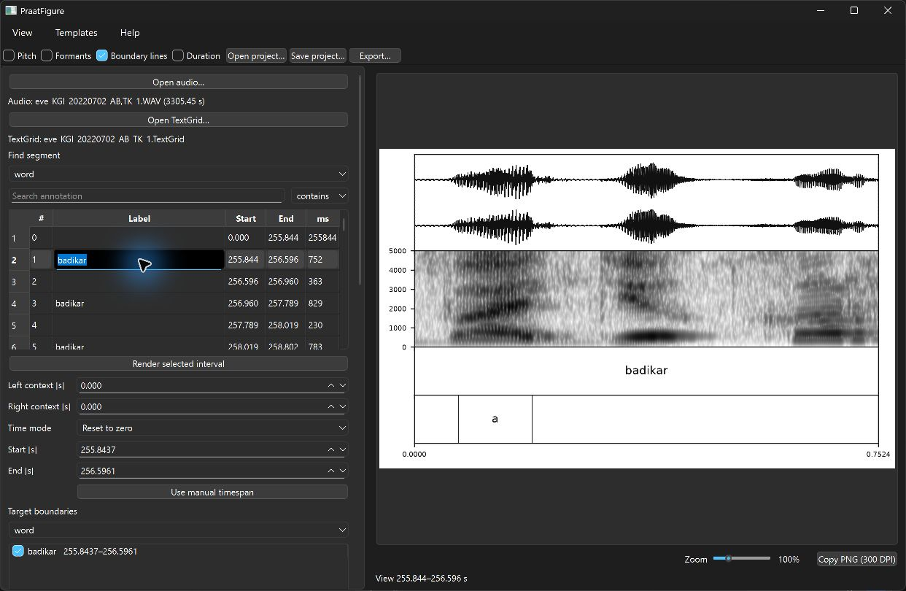
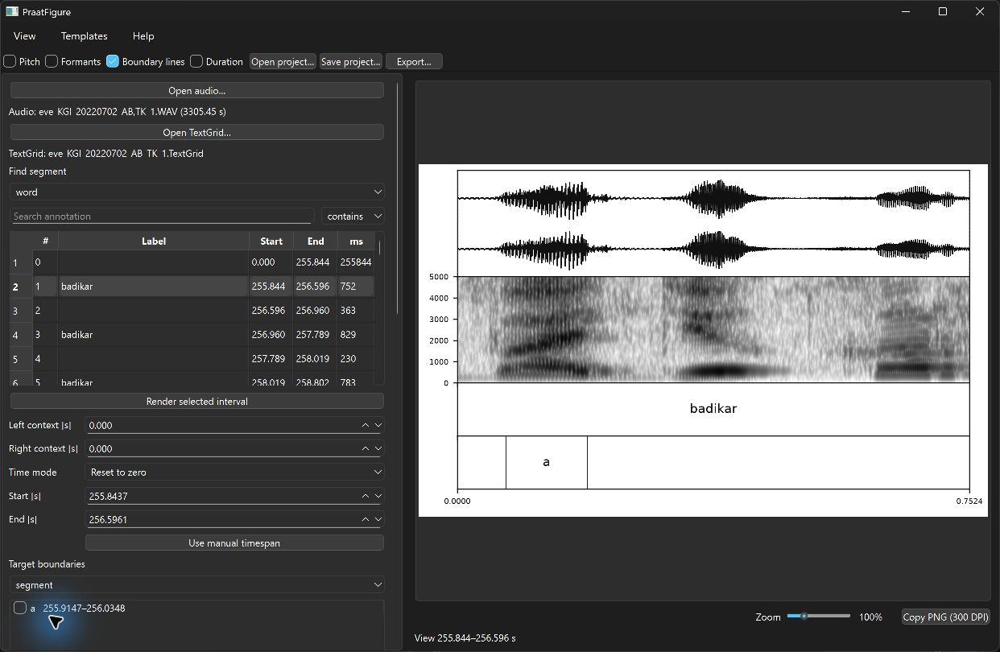
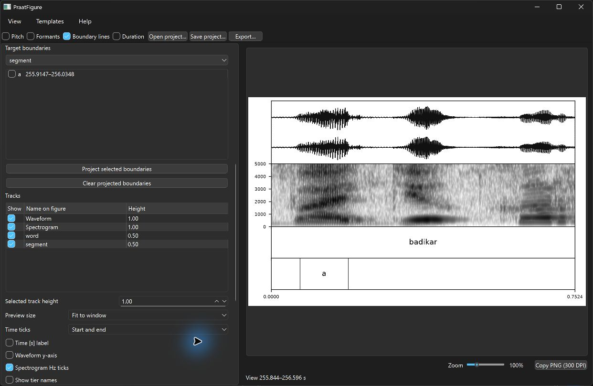
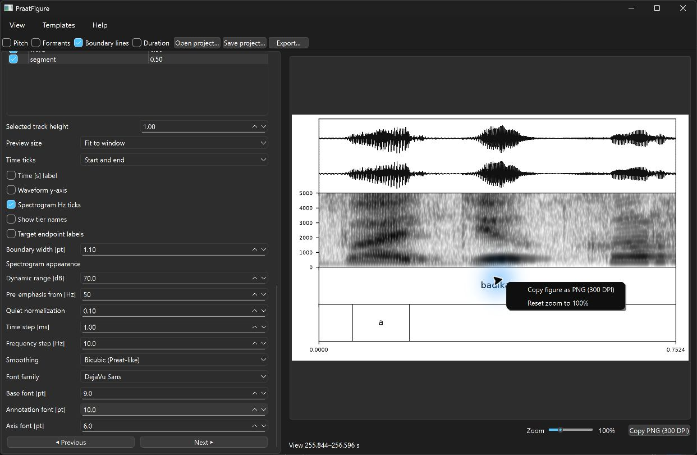
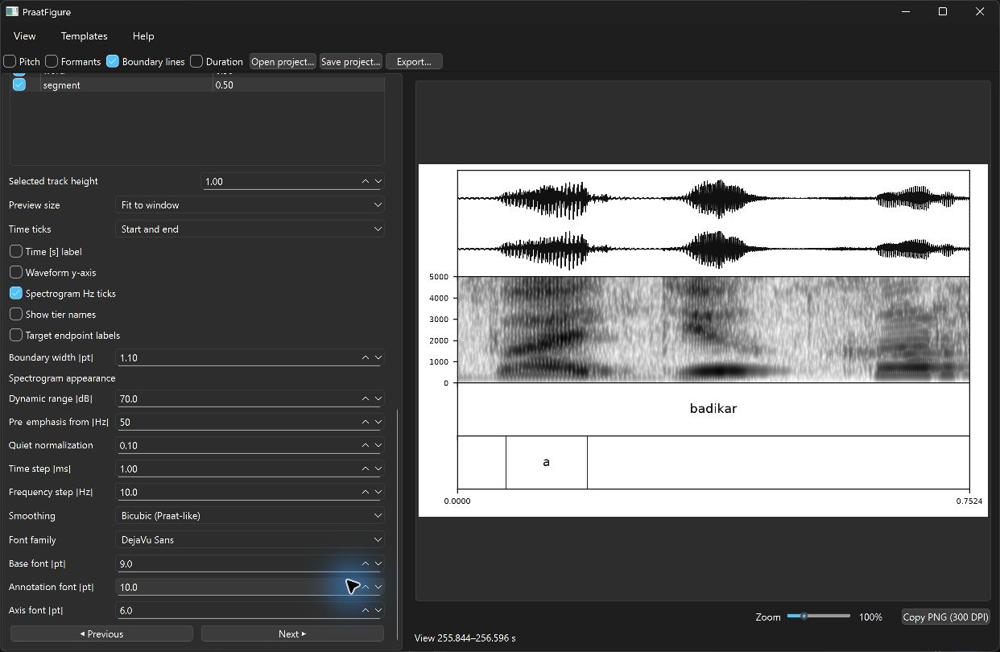
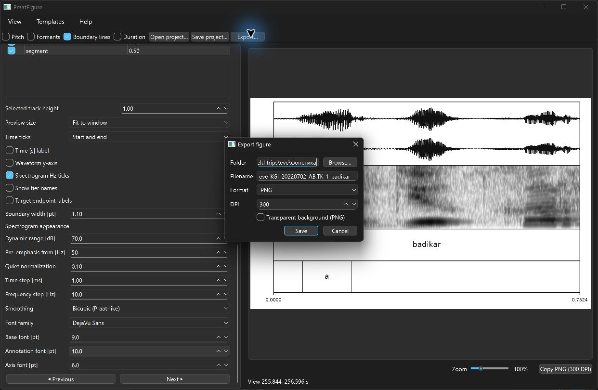

# Complete interface guide

This guide starts with the shortest path from source files to a finished figure.
The later sections explain every control in the desktop interface, including the
less frequently changed publication and acoustic settings.

## The essential workflow

Most figures can be produced in six steps:

1. Select **Open audio…** and open the recording.
2. Select **Open TextGrid…** and open the matching Praat annotation.
3. Under **Find segment**, choose a tier and find the interval you need.
4. Double-click the interval, or select it and press **Render selected interval**.
5. Check the tracks and labels in the preview.
6. Press **Export…** or **Copy PNG (300 DPI)**.

PraatFigure remembers the last folder used by any file dialog. Opening the next
audio file, TextGrid, project, template, or export starts in that folder, even
after the application has been restarted.

{ .guide-shot }

The window has three main areas:

1. The **menu and quick controls** at the top affect the most common overlays
   and file operations.
2. The scrollable **control panel** on the left selects the time span and
   configures the figure.
3. The **preview** on the right shows the complete composition and provides
   zoom, panning, and clipboard commands.

The divider between the control panel and preview can be dragged. The left panel
scrolls vertically when all options do not fit on screen.

## 1. Open the source files

### Open audio…

Opens a WAV, FLAC, AIFF, or MP3 recording. The line below the button reports the
filename and duration. Long recordings are handled by reading only the required
time region during analysis rather than decoding the complete recording for
every redraw.

### Open TextGrid…

Opens a Praat TextGrid and fills the tier selectors. If no audio is open and a
single matching WAV, FLAC, or AIFF file is found beside the TextGrid,
PraatFigure opens it automatically.

After both files are available, an initial preview is limited to ten seconds.
Choose an annotation or a manual time span to render the actual example.

## 2. Find and render the main interval

### Find segment: tier selector

Chooses the TextGrid tier searched by the controls below it. For example, select
`word` to find a complete word that will define the width of the figure.

### Search annotation

Filters the selected tier. An empty field lists every entry. The adjacent search
mode controls interpretation:

| Mode | Meaning | Example |
| --- | --- | --- |
| **contains** | Label contains the entered text | `bad` finds `badikar` |
| **exact** | Complete label must match | `a` finds only `a` |
| **regex** | Python regular expression | `^(a|i)$` finds `a` or `i` |

Scrolling the page while the pointer is over a closed drop-down list does not
change its value. Open a list deliberately with a click or keyboard command.

### Results table

Each row is one TextGrid entry:

| Column | Meaning |
| --- | --- |
| **#** | Entry index on the tier |
| **Label** | TextGrid annotation text |
| **Start** | Absolute start time in seconds |
| **End** | Absolute end time in seconds |
| **ms** | Interval duration in milliseconds |

Double-clicking a row immediately uses it as the view. A single click followed
by **Render selected interval** does the same thing.

### Left context and Right context

Add time before or after an annotation when it is rendered. Both values default
to `0.000`, so the figure initially matches the exact annotation boundaries.
Context is useful when a transition or neighbouring segment must remain visible.

### Time mode

Changes the numbers printed on the time axis without changing the selected
audio:

| Mode | Axis origin |
| --- | --- |
| **Reset to zero** | Beginning of the complete view |
| **Original time** | Absolute time in the recording |
| **Zero at target** | Beginning of the first selected target interval |

### Start [s], End [s], and Use manual timespan

The two fields always contain absolute recording times. Edit them and press
**Use manual timespan** to draw any arbitrary region without selecting a
TextGrid interval. Manual selections use their time range in the suggested
export filename.

## 3. Select inner boundaries

The main view and projected target are separate concepts. A word can define the
view while only one vowel inside that word supplies the dashed boundaries,
endpoint labels, or duration.

{ .guide-shot }

### Target boundaries: tier selector

Chooses the tier containing the intervals of interest. PraatFigure lists only
entries completely inside the current main interval or manual view.

### Target list and checkboxes

Every row shows the annotation and its absolute start–end time. Check one or
more rows to make them targets. Uncheck a row to remove only that target. This
is useful when a word contains many annotated segments but only one vowel needs
to be highlighted.

### Project selected boundaries

Checks the currently selected list rows and projects their boundaries. The
**Boundary lines** quick control is enabled automatically when targets are
selected.

### Clear projected boundaries

Unchecks every target. The underlying TextGrid is never modified.

### Three independent target displays

- **Boundary lines** draws dashed vertical lines through acoustic tracks.
- **Target endpoint labels** prints the target start and end above the figure.
- **Duration** prints the target duration.

These options are independent. For example, enable **Duration** while leaving
boundary lines and endpoint labels off to show only `120 ms`. Labels belonging
to very short intervals are pushed apart automatically to avoid overlap.

## 4. Arrange tracks

{ .guide-shot }

The **Tracks** table represents the vertical stack in the exported figure.

### Show

Includes or excludes a track. Waveform and spectrogram visibility is controlled
here rather than by duplicate toolbar options.

### Name on figure

Double-click a cell to change the name printed beside that layer. This is a
display-only name: it does not rename the tier inside the TextGrid.

### Height

Double-click a height cell or select the row and use **Selected track height**.
Values are relative:

- waveform: `1.0` by default;
- spectrogram: `1.0` by default;
- each TextGrid tier: `0.5` by default.

Thus, a `1.0` track is twice as tall as a `0.5` track. Values between `0.2` and
`5.0` are accepted.

### Reorder tracks

Drag a row between other rows. The preview redraws immediately. Dropping a row
onto another row changes only its position; neither row is deleted.

## 5. Control the preview

### Preview size

- **Fit to window** fits the complete final composition into the available
  preview area.
- **Real size** displays the configured physical figure dimensions at the
  screen's logical DPI. Scroll bars appear when necessary.

Fonts, lines, pitch, and formant markers scale with the composition in both
modes, so their proportions match the exported image.

### Zoom slider and Ctrl + wheel

The slider below the image ranges from 25% to 400%. Hold **Ctrl** and use the
mouse wheel or two-finger touchpad scroll over the preview for 5% steps.

At 100%, the scale is the fitted size in **Fit to window** mode and the physical
size in **Real size** mode. If the enlarged figure exceeds the viewport, drag it
with the left mouse button to inspect another area. An open-hand cursor indicates
that panning is available.

### Preview context menu

Right-click the image to open two commands:

- **Copy figure as PNG (300 DPI)**;
- **Reset zoom to 100%**.

{ .guide-shot }

### Copy PNG (300 DPI)

The button below the preview performs the same copy command. PraatFigure renders
a new complete 300 DPI PNG and places it on the clipboard; it does not take a
screenshot of the scaled preview. Paste it directly into a document, slide, or
image editor.

### Status line

The bottom line reports the visible absolute time range, ongoing analysis,
successful copying/export, or an error that needs attention.

## 6. Configure axes, labels, and boundaries

### Time ticks

- **Start and end** prints only the two endpoints and is the default.
- **Automatic** lets Matplotlib choose intermediate ticks.
- **Hidden** removes time ticks and the bottom time axis.

### Time [s] label

Adds the text `Time (s)` below the figure. It is independent from the time tick
mode.

### Waveform y-axis

Shows amplitude ticks and the waveform-axis label. It is hidden by default for
a cleaner publication figure.

### Spectrogram Hz ticks

Shows frequency ticks in hertz. It is enabled by default.

### Show tier names

Prints track names at the left of TextGrid layers. The left margin is calculated
for every figure so long custom names remain inside the frame.

### Target endpoint labels

Prints the transformed start and end time of each target above the top acoustic
track. This option does not require dashed boundary lines.

### Boundary width [pt]

Sets the physical width of projected dashed lines. The publication default is
`1.10 pt`.

## 7. Configure the spectrogram

{ .guide-shot }

These settings affect the image only; source audio is never changed.

### Dynamic range [dB]

Controls how far below the local maximum energy remains visible. A larger value
shows more weak energy and background noise. A smaller value produces a cleaner,
higher-contrast spectrogram. The default is `70 dB`.

### Pre-emphasis from [Hz]

Applies a Praat-like 6 dB/octave display emphasis above the chosen frequency.
The default is `50 Hz`. Set it to the control's off value to disable emphasis.

### Quiet normalization

Balances quiet and loud time slices. The range is 0–1; the default `0.10` makes
weak regions easier to inspect without fully equalising every slice. Increase
it when quiet segments disappear, or reduce it when background noise becomes
too prominent.

### Time step [ms]

Controls the requested horizontal analysis-grid spacing. Smaller values provide
more temporal detail but take longer to calculate. The publication default is
`1.00 ms`.

### Frequency step [Hz]

Controls the requested vertical analysis-grid spacing. Smaller values provide
more frequency detail at the cost of computation. The default is `10 Hz`.

### Smoothing

| Mode | Use |
| --- | --- |
| **Bicubic (Praat-like)** | Smoothest display and the default |
| **Bilinear** | Lighter, faster interpolation |
| **Nearest (raw)** | Shows individual analysis cells without smoothing |

Smoothing changes display interpolation, not acoustic resolution. Changing it
does not recalculate the spectrogram analysis.

## 8. Configure fonts

### Font family

Lists fonts installed on the current operating system. Choose a family that
contains every character used by the annotations. A project or template keeps
the chosen family name; another computer must have that font installed to match
the appearance exactly.

### Base font [pt]

Controls general figure text such as duration labels and other non-tier text.

### Annotation font [pt]

Controls labels printed inside TextGrid intervals.

### Axis font [pt]

Controls tick labels, endpoint times, and axis-related text. The default is
`6.0 pt`.

All sizes are physical points. The preview scales the entire composition rather
than changing font sizes independently.

## 9. Move between examples

### Previous and Next

Move to the previous or next row in the current search result and render it.
The current tier, query, context, and appearance stay in place, making these
buttons convenient for checking a sequence of examples.

## 10. Top quick controls

### Pitch

Adds a pitch contour to visible spectrogram tracks. Analysis is restricted to
the current time window and cached.

### Formants

Adds F1 and F2 points to visible spectrogram tracks. Marker sizes use physical
units and therefore remain proportional in the preview and export.

### Boundary lines

Shows or hides projected dashed target boundaries. It does not clear target
checkboxes, so the same selection can be shown again later.

### Duration

Shows target duration independently of boundaries and endpoint labels. The
display automatically uses milliseconds for short intervals unless a saved
project specifies another unit.

### Open project… and Save project…

A `.praatfig.json` project stores the audio and TextGrid paths, current time
selection, targets, tracks, names, order, heights, and all appearance settings.
Use a project to continue the exact same session later. If source files are
moved to another computer, their stored paths may need updating.

### Export…

Opens the full export dialog described below.

## 11. Export the figure

{ .guide-shot }

### Folder

The destination directory. **Browse…** opens a folder chooser. On the next use,
PraatFigure starts from the last folder used anywhere in the application.

### Filename

Editable Unicode filename without the extension. For annotation selections, the
suggestion includes the audio name and annotation. For a manual view, it includes
the absolute time interval. Invalid filesystem characters are replaced safely.

### Format

- **PNG** is the default and works well in slides and word processors.
- **SVG** keeps text, lines, and frames as vector elements and is ideal for
  further editing.
- **PDF** is a publication-friendly vector format.

### DPI

Controls raster resolution, including spectrogram pixels in every format. Text
and line art remain vector elements in SVG and PDF. `300` is a suitable default
for print publication.

### Transparent background (PNG)

Removes the solid figure background for PNG output. Leave it off when the target
application does not handle transparency reliably.

### Save and Cancel

**Save** writes the file. Existing files are never silently overwritten: a
confirmation is shown first. **Cancel** closes the dialog without exporting.

## 12. Menus

### View

Shows or hides the **Quick controls** toolbar. The toolbar cannot accidentally
disappear through its own context menu; use **View** to restore it.

### Templates

- **Save settings template…** stores tracks, order, visibility, heights,
  display names, fonts, acoustic settings, axes, and other appearance options.
- **Load settings template…** applies those settings to the current files and
  selection.

A template deliberately excludes the current audio path, TextGrid path, view,
and targets, so one publication style can be reused for many examples.

### Help

**Quick start and controls** opens an in-application summary of the main
workflow and shortcuts.

## Recommended first settings

The defaults are intended to produce a clean starting figure:

| Setting | Default |
| --- | --- |
| Left/right context | `0.000 s` |
| Time mode | Reset to zero |
| Time ticks | Start and end |
| Waveform / spectrogram height | `1.0` |
| TextGrid tier height | `0.5` |
| Spectrogram Hz ticks | On |
| Smoothing | Bicubic (Praat-like) |
| Axis font | `6.0 pt` |
| Export format | PNG |
| Export DPI | `300` |

For most work, first choose the correct interval and target, then arrange tracks,
and only then adjust acoustic detail and typography. This keeps the main task
simple while leaving every publication detail available when it is needed.

